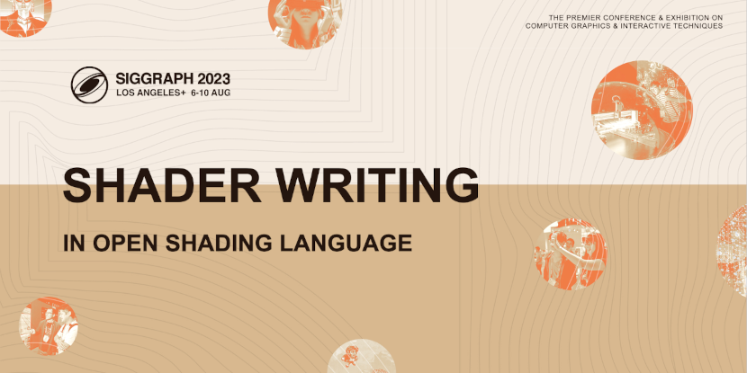

# OSLShaderWriting

This repository contains the [Siggraph 2023](https://s2023.siggraph.org/presentation/?id=gensubcur_104&sess=sess329) [Shader Writing in Open Shading Language](https://dl.acm.org/doi/10.1145/3587423.3597945) course material.
It is an updated version of the [Siggraph 2022 OSL Shaders for RenderMan](https://dl.acm.org/doi/abs/10.1145/3532724.3535604) course and its [repository](https://github.com/LaikaStudios/OSLShadersForRenderMan).
[Open Shading Language](https://github.com/AcademySoftwareFoundation/OpenShadingLanguage) is a project of the [Academy Software Foundation](https://www.aswf.io/projects).

Specifically, this repository contains the [`osl`](osl) source code for all shaders and the [make](https://www.gnu.org/software/make/manual/) and [python3](https://docs.python.org/3/) based build system desribed in the course,
with some enhancements from the [Layered Shading (LaSh)](https://github.com/LaikaStudios/LaSh) repository.

While the build system's [`Makefile`](Makefile) and [`osl`](osl) shaders are configured to use [RenderMan 25](https://rmanwiki.pixar.com/display/REN25/RenderMan+25+Documentation), they will be easily altered to operate in whatever rendering system and application environment you use.

Documentation is in the [`doc`](doc) directory.

Please feel free to use the [Discussions Tab](https://github.com/LaikaStudios/OSLShaderWriting/discussions).
I'd love you hear what you think, or to discuss any issues or thoughts you may have about the course or this repository and its contents.

# License
This repository's content is licensed under either the

* Apache License, Version 2.0, ([LICENSE-APACHE](LICENSE-APACHE) or http://www.apache.org/licenses/LICENSE-2.0) or
* MIT license ([LICENSE-MIT](LICENSE-MIT) or http://opensource.org/licenses/MIT)

at your option.

