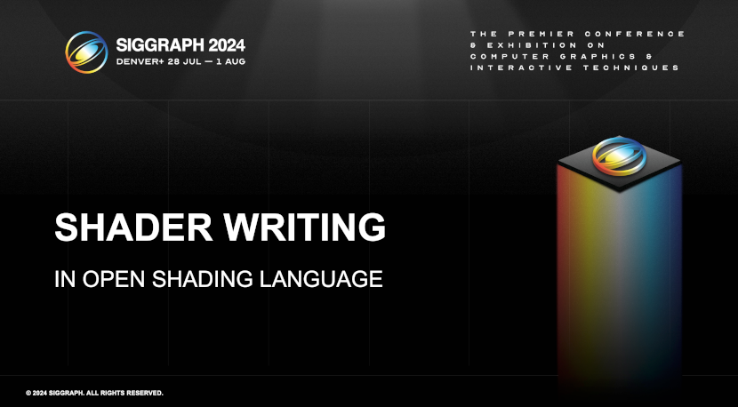

This repository contains the supplemental materials for the
[Siggraph 2024 Course](https://dl.acm.org/doi/proceedings/10.1145/3664475):
[Shader Writing in Open Shading Language](https://dl.acm.org/doi/10.1145/3664475.3664534).
The [recorded presentation](https://s2024.conference-program.org/presentation/?id=gensub_147&sess=sess165)
is also available to Siggraph conference registrants.

Specifically, this repository contains the [`osl`](osl) source code for the shaders and the [make](https://www.gnu.org/software/make/) and [python](https://www.python.org/) based build system desribed in the course.

Documentation is in the [`doc`](doc) directory.

[Open Shading Language](https://github.com/AcademySoftwareFoundation/OpenShadingLanguage) is a project of the [Academy Software Foundation](https://www.aswf.io/projects).

Please feel free to use the [Discussions Tab](https://github.com/LaikaStudios/OSLShaderWriting/discussions).
I'd love you hear what you think, or to discuss any issues or thoughts you may have about the course or this repository and its contents.

# License
This repository's content is licensed under either the

* Apache License, Version 2.0, ([LICENSE-APACHE](LICENSE-APACHE) or http://www.apache.org/licenses/LICENSE-2.0) or
* MIT license ([LICENSE-MIT](LICENSE-MIT) or http://opensource.org/licenses/MIT)

at your option.

