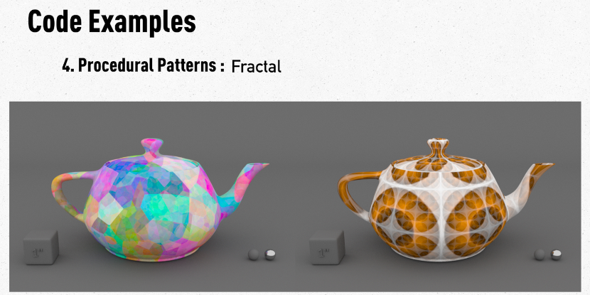

# Documentation



The documenation for this repository is the [Siggraph 2023](https://s2023.siggraph.org/presentation/?id=gensubcur_104&sess=sess329) course itself: [Shader Writing in Open Shading Language](https://dl.acm.org/doi/10.1145/3587423.3597945).

However, here is some additional information about this repositry's content and how to make use of it.

# Requirements
* `make`
* `python3`
* [RenderMan 25](https://rmanwiki.pixar.com/display/REN25/RenderMan+25+Documentation) was used to develop the shaders and the build system.

Other rendering and application systems can still make use of the [`osl`](./osl/) shading nodes and [make](https://www.gnu.org/software/make/manual/) system with minor alterations.

# Quick Start
To use the supplied repository content as is:

1. Set up RenderMan:

    * Install [RenderManProServer](https://renderman.pixar.com/store) and ensure it is functioning properly.

1. Set these environment variables appropriately. These are required by the [make](https://www.gnu.org/software/make/manual/) system that's used to compile and install the shaders:
    * PIXAR_ROOT
    * RMAN_VERSION

    For example, if your version of RenderManProServer is installed in
    `/opt/pixar/RenderManProServer-25.0`, then using `bash` shell:

    ```bash
    export PIXAR_ROOT="/opt/pixar"
    export RMAN_VERSION="25.0"
    ```
    
    Since RenderManProServer requires an RMANTREE environment variable to be set to its installation location, you can conveniently use these to define it as well:
    
    ```bash
    export RMANTREE="${PIXAR_ROOT}/RenderManProServer-${RMAN_VERSION}"
    ```

1. Download or [clone](https://docs.github.com/en/repositories/creating-and-managing-repositories/cloning-a-repository) this repository.
1. `cd` into the dowloaded or cloned repository's directory.

1. At this point, you can use the `make` or `make all` command (they are equivalent) to build the shaders.
You can also `cd osl` into the osl directory and `make` the shaders there.
The osl [`Makefile`](../osl/Makefile) will only make shaders for .osl files that are more recent than their complied shader.
In this way, you can edit a source file and execute `make` from within the osl directory and only the updated source file(s) will be built.

    `make clean` and `make help` can also be executed from either the top-level directory or the osl directories.
`make clean` removes the built shaders, and `make help` provides additional information about the make system and how it's controlled.

1. Set these environment variables appropriately. This is required so the built shaders can be found by [RenderMan](https://rmanwiki.pixar.com/display/REN24/RenderMan) and a [RenderMan Bridge Application](https://renderman.pixar.com/bridge-tools):

    - RMAN_SHADERPATH

    For example, if you downloaded or cloned this repository to `${HOME}/OSLShaderWriting`, then using `bash` shell:

    ```bash
    export RMAN_SHADERPATH="${HOME}/OSLShaderWriting/build/${RMAN_VERSION}/shaders:${RMAN_SHADERPATH}"
    ```

# License
This repository's content is licensed under either the

* Apache License, Version 2.0, ([LICENSE-APACHE](../LICENSE-APACHE) or http://www.apache.org/licenses/LICENSE-2.0) or
* MIT license ([LICENSE-MIT](../LICENSE-MIT) or http://opensource.org/licenses/MIT)

at your option.


