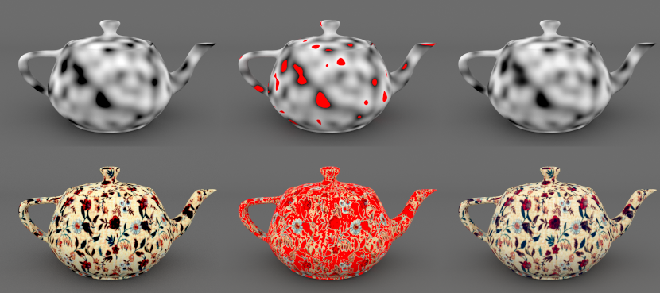

# Documentation



The documenation for this repository is the [Siggraph 2024](https://s2024.conference-program.org/presentation/?id=gensub_147&sess=sess165) course itself: [Shader Writing in Open Shading Language]().

However, here is some additional information about this repositry's content and how to make use of it.

# Requirements
* [make](https://www.gnu.org/software/make/)
* [python](https://www.python.org/)
* [RenderMan](https://rmanwiki.pixar.com/display/REN) was used to develop the shaders and the build system.

Other rendering and application systems can still make use of the [`osl`](../osl/) shading nodes with little or no changes.

While a Linux system was used to develop this repository's content, as long as a `make` command and `python` are available, any necessary modifications to the Makefiles and python installation script should be minor or non-existent.

# Installation
To use the supplied repository content as is:

1. Get a [professional](https://renderman.pixar.com/store) (paid) or 
[non-commercial](https://renderman.pixar.com/store) (free)  license for 
[RenderMan](https://renderman.pixar.com/product).

1. [Install RenderMan](https://rmanwiki.pixar.com/display/REN/Installation+and+Licensing) and ensure it is functioning properly.

1. Set these environment variables appropriately. These are required by the [make](https://www.gnu.org/software/make/) system that's used to build and install the shaders:
    * PIXAR_ROOT
    * RMAN_VERSION

    For example, if your version of the RenderMan renderer is installed in
    `/opt/pixar/RenderManProServer-26.1`, then using `bash` shell:

    ```bash
    export PIXAR_ROOT="/opt/pixar"
    export RMAN_VERSION="26.1"
    ```
    
    And since RenderMan requires an RMANTREE environment variable to be set to the renderer's installation location, you can conveniently use these to define that as well:
    
    ```bash
    export RMANTREE="${PIXAR_ROOT}/RenderManProServer-${RMAN_VERSION}"
    ```

1. Download or [clone](https://docs.github.com/en/repositories/creating-and-managing-repositories/cloning-a-repository) this repository.

1. Set this environment variable appropriately. This is required so the built shaders can be found by RenderMan:

    - RMAN_SHADERPATH

    For example, if you downloaded or cloned this repository to `${HOME}/OSLShaderWriting`, then using `bash` shell:

    ```bash
    export RMAN_SHADERPATH="${HOME}/OSLShaderWriting/build/${RMAN_VERSION}/shaders:${RMAN_SHADERPATH}"
    ```

1. `cd` into the dowloaded or cloned repository's directory.

1. At this point, you can use the `make` or `make all` command (they are equivalent) to build the shaders.
You can also `cd osl` into the osl directory and `make` the shaders there.
The osl [`Makefile`](../osl/Makefile) will only make shaders for .osl files that are more recent than their complied .oso file.
In this way, you can edit a source file and execute `make` from within the osl directory and only the updated source file(s) will be built.

    `make clean` and `make help` can also be executed from either the top-level directory or the osl directory.
`make clean` removes the built shaders, and `make help` provides additional information about the make system and how it's controlled.


# Development

To modify the existing shaders or to develop your own, `cd` into the `osl` directory. This is where you will run `make` in order to build any modified or new shaders during their development.

To create a new category of shader, create a directory with the category's name in the `osl` directory and add it to the `osl/Makefile`'s `SUBDIRS` variable on line 34.
Any `.osl` files in this new directory will then also be built when `make` is executed from the `osl` directory location.

To build the entire set of shaders, run `make clean ; make -j` from the cloned repository's directory rather than the `osl` directory.

If you [cloned](https://docs.github.com/en/repositories/creating-and-managing-repositories/cloning-a-repository)
this repository, you'll have created a local [git](https://git-scm.com/) repository, so all the source code management tools of git will be available to you.
If you are not already famililar with git, it will be very worthwile to at least learn the basics of adding new files and committing changes for existing ones.

At this point you're all set to start writing or modifying your very own OSL shaders!